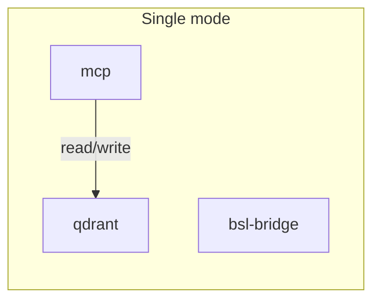
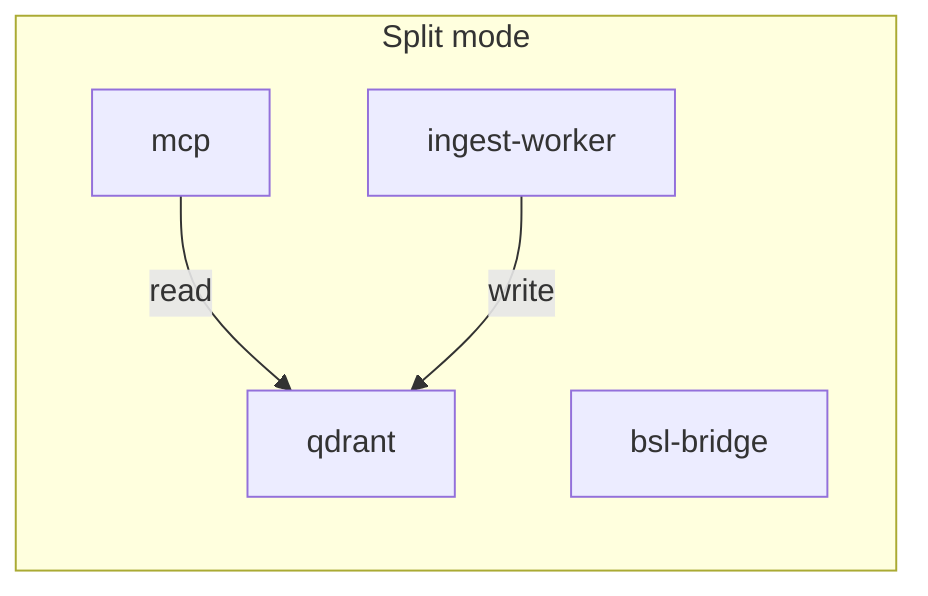

# Архитектура 1C Help MCP

## Сервисы и ответственность

| Сервис | Роль | Ресурсы | Порт |
|--------|------|---------|------|
| **qdrant** | Векторная БД (onec_help, onec_help_memory) | Хранилище | 6333 |
| **mcp** | MCP API — поиск, чтение топиков, get_1c_code_answer | I/O, embedding для memory | 5050 |
| **ingest-worker** | Batch ETL: ingest, cron, load-snippets, watchdog | CPU, RAM, embedding API | — |
| **serve** | Веб-просмотр справки (Flask), профиль `serve` | I/O | 5000 |
| **bsl-bridge** | BSL LS MCP — диагностика, рефакторинг | Java/BSL LS | — |

## Коллекции Qdrant

- **onec_help** — основной индекс справки 1С (пишет ingest/indexer)
- **onec_help_memory** — snippets, standards, session events (пишут memory, load-snippets, load-standards)

Подробнее об embedding, batch-пайплайне, retry и переменных — см. [docs/embedding.md](embedding.md).

## Режимы развёртывания

### Single (по умолчанию)

Один контейнер `mcp` выполняет MCP API, ingest при старте, cron, load-snippets и watchdog. `MCP_MODE=full`.



### Split

`mcp` только MCP API (`MCP_MODE=api`), `ingest-worker` — все write-операции. Независимая отказоустойчивость и масштабирование.



Запуск:
```bash
docker compose -f docker-compose.split.yml up -d
```

С веб-просмотром (профиль `serve`):
```bash
docker compose -f docker-compose.split.yml --profile serve up -d
```

## Будущие улучшения (при росте)

- **Очередь задач:** замена cron на Celery/RQ + Redis или API webhook для ingest — масштабирование и retry при сбоях.

## Когда использовать split

- Несколько разработчиков используют MCP одновременно
- Ingest тяжёлый (много версий 1С) и мешает отклику MCP
- Production с требованиями по uptime MCP
- Нужна независимая отработка сбоев ingest и MCP

## Переменная MCP_MODE

- **`full`** (по умолчанию) — entrypoint запускает ingest, cron, watchdog, load-snippets в фоне
- **`api`** — только основной процесс (MCP), без фоновых jobs

Альтернатива: `ENTRYPOINT ["/app/entrypoint-mcp-only.sh"]` — минимальный entrypoint без фона.

## Пересборка и обновление при изменениях

### Пересборка одного образа без перезапуска остальных

```bash
# Только пересобрать образ
docker compose build mcp
# или для split:
docker compose -f docker-compose.split.yml build mcp

# Пересобрать и перезапустить только один контейнер
docker compose up -d --build mcp
# split:
docker compose -f docker-compose.split.yml up -d --build mcp
```

При указании имени сервиса Compose пересобирает только его образ и перезапускает только его контейнер; qdrant, bsl-bridge и другие не трогаются.

### Общий образ mcp и ingest-worker

`mcp` и `ingest-worker` собираются из одного Dockerfile — при изменении кода Python нужно пересобрать оба, но можно указать их вместе:

```bash
docker compose -f docker-compose.split.yml up -d --build mcp ingest-worker
```

### Типовой workflow при изменениях

| Что меняли | Команда (single) | Команда (split) |
|------------|------------------|-----------------|
| Код Python (onec_help) | `docker compose up -d --build mcp` | `docker compose -f docker-compose.split.yml up -d --build mcp ingest-worker` |
| Только MCP API | `docker compose up -d --build mcp` | `docker compose -f docker-compose.split.yml up -d --build mcp` |
| Только ingest/cron | `docker compose up -d --build mcp` | `docker compose -f docker-compose.split.yml up -d --build ingest-worker` |
| Dockerfile, requirements | `docker compose build mcp` затем `up -d` | `docker compose -f docker-compose.split.yml build mcp ingest-worker` затем `up -d` |
| Только env/volumes в compose | `docker compose up -d` | `docker compose -f docker-compose.split.yml up -d` |

Изменение env или volumes не требует пересборки — Compose пересоздаёт только затронутые контейнеры.
